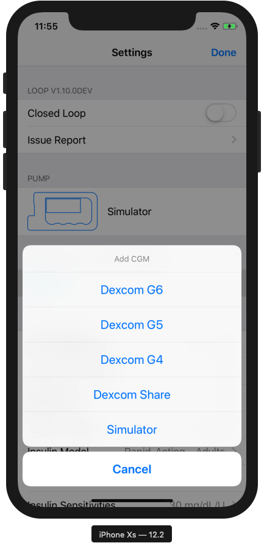
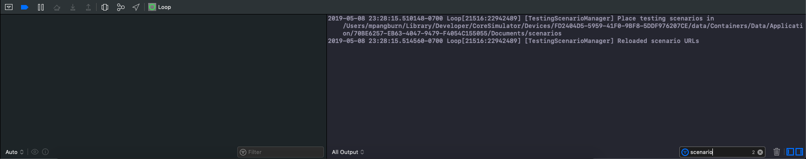
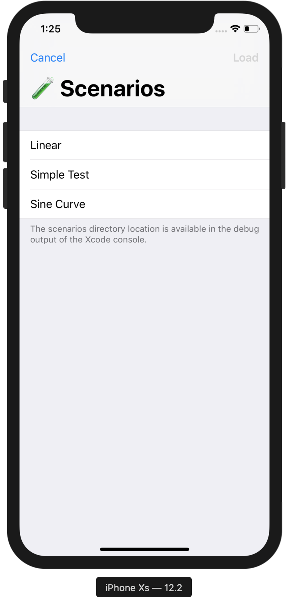
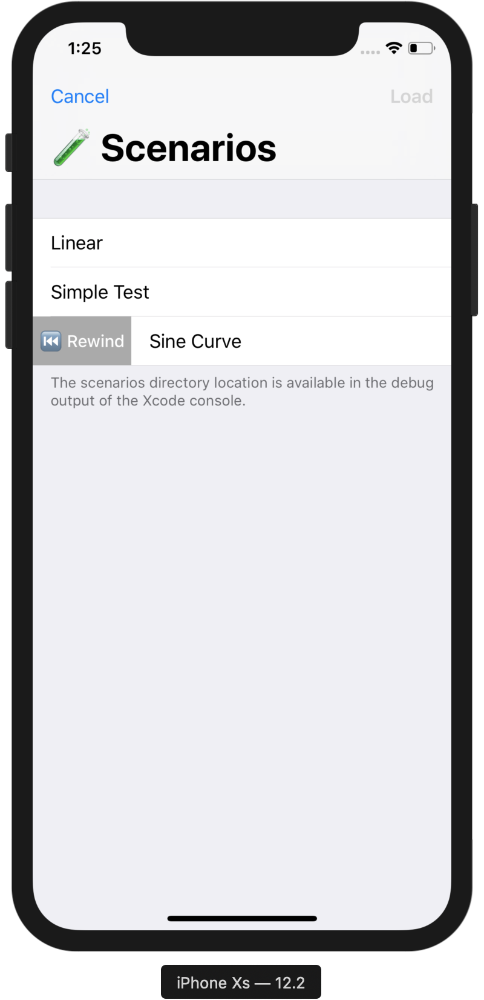

# Guide: Testing Scenarios

## Purpose

This document describes how to load data-based scenarios, including glucose values, dose history, and carb entries, into Loop on demand.

## File Format

A scenario consists of a single JSON file containing glucose, basal, bolus, and carb entry histories. Each history corresponds to a property of the scenario JSON object—a list of individual entries. Each entry has one or more properties describing its value (e.g. `unitsPerHourValue` and `duration`) and a _relative_ date offset, in seconds (e.g. 0 means 'right now' and -300 means '5 minutes ago').

For example, a carb entry history might look like this:

```json
"carbEntries": [
    {
        "gramValue": 30, 
        "dateOffset": -300, 
        "absorptionTime": 10800
    }, 
    {
        "gramValue": 15, 
        "dateOffset": 900, 
        "absorptionTime": 7200, 
        "enteredAtOffset": -900
    }
]
```

Carb entries have two date offsets: `dateOffset`, which describes the date at which carbs were consumed, and `enteredAtOffset`, which describes the date at which the carb entry was created. The second carb entry in the example above was entered 30 minutes early.

## Generating Scenarios

A Python script with classes corresponding to the entry types is available at `/Scripts/make_scenario.py`. Running it will generate a sample script, which will allow you to inspect the file format in more detail.

## Loading Scenarios

Launch Loop in the Xcode simulator.

Before loading scenarios, mock pump and CGM managers must be enabled in Loop. From the status screen, tap the settings icon in the bottom-right corner; then, tap on each of the pump and CGM rows and select the Simulator option from the presented action sheets:



Next, type 'scenario' in the search bar in the bottom-right corner of the Xcode console with the Loop app running:



The first line will include `[TestingScenariosManager]` and a path to the simulator-specific directory in which to place scenario JSON files.

With one or more scenarios placed in the listed directory, the debug menu can be activated by "shaking" the iPhone: in the simulator, press ^⌘Z.  The scenario selection screen will appear:



Tap on a scenario to select it, then press 'Load' in the top-right corner to load it into Loop.

With the app running, additional scenarios can be added to the scenarios directory; the changes will be detected, and the scenario list reloaded.

## Time Travel

Because all historic date offsets are relative, scenarios can be stepped through one or more loop iterations at a time, so long as the scenario contains sufficient past or future data.

Swiping right or left on a scenario cell reveals the  'rewind' or 'advance' button, respectively:



Tap on the button, and you will be prompted for a number of loop iterations to progress backward or forward in time. Note that advancing forward will run the full algorithm for each step and in turn apply the suggested basal at each decision point.

For convenience, an active scenario can be stepped through without leaving the status screen. Swipe right or left on the toolbar at the bottom of the screen to move one loop iteration into the past or future, respectively.
